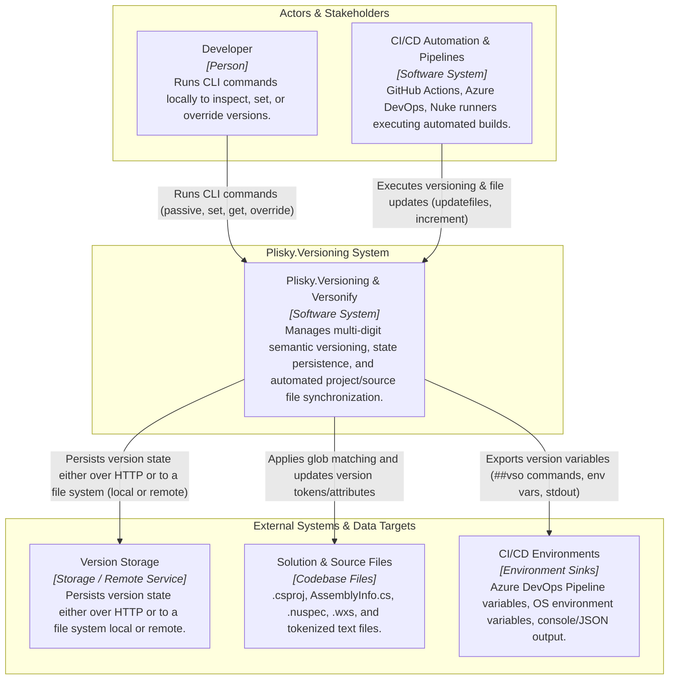
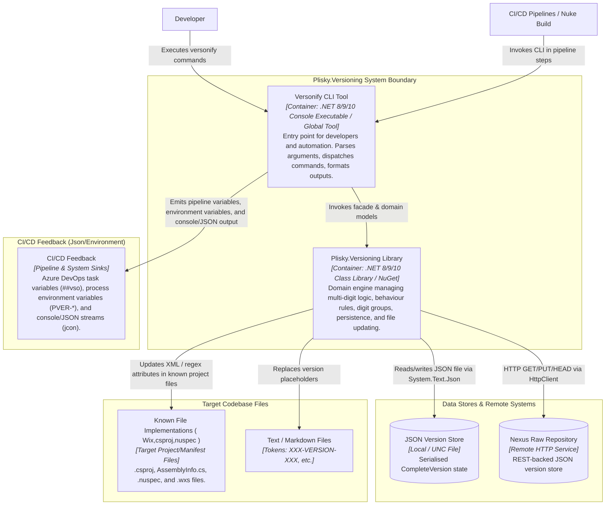
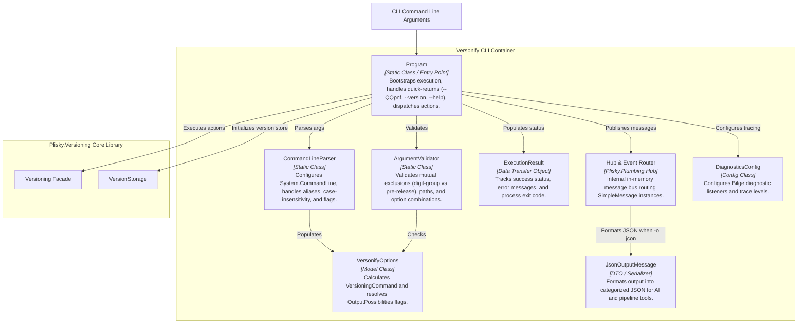
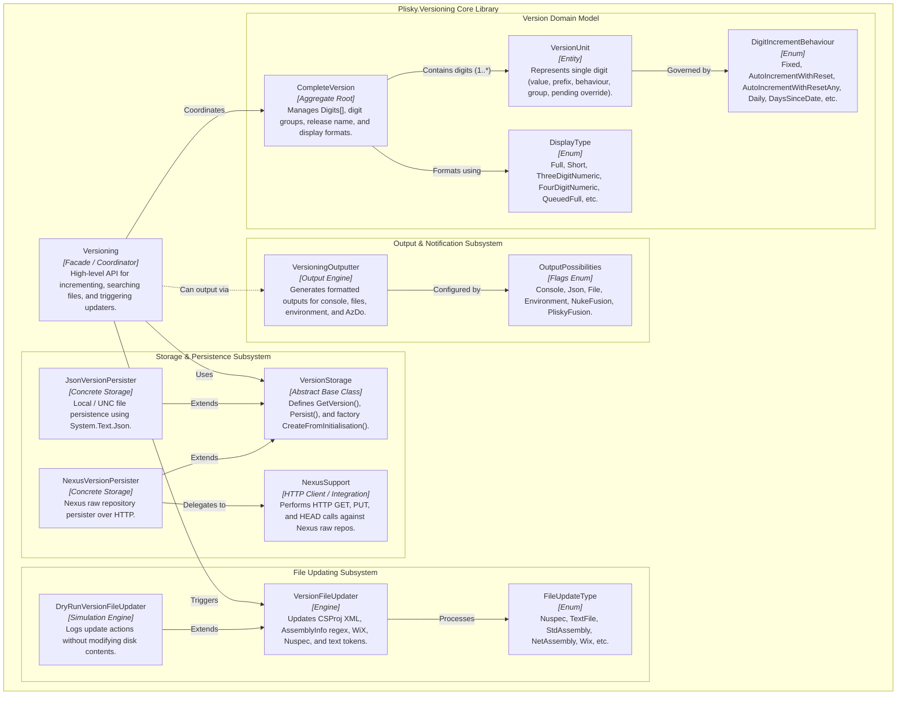
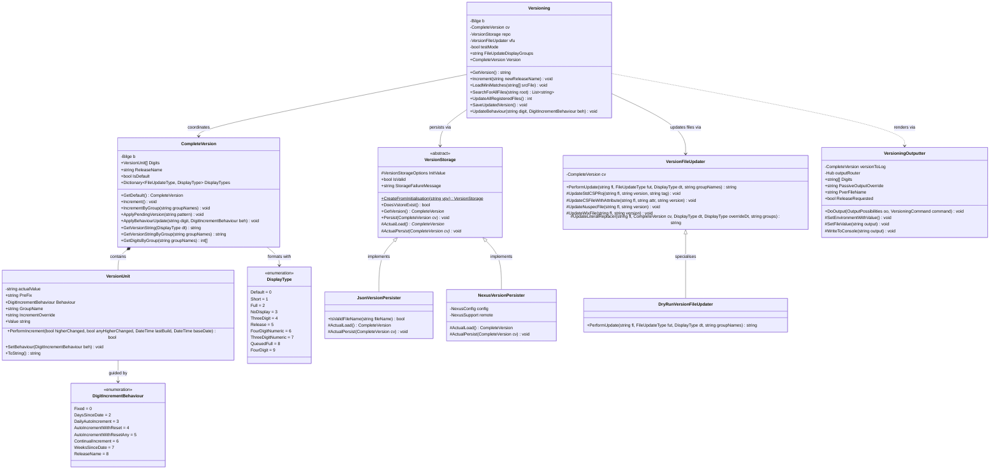
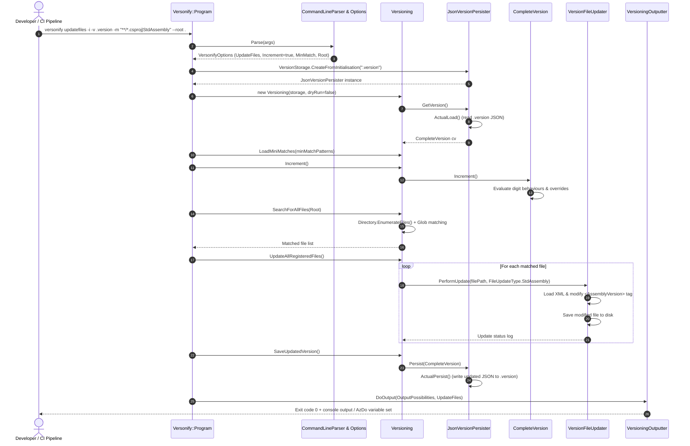

# C4 Architectural Model: Plisky.Versioning & Versonify

This document provides a comprehensive C4 (Context, Container, Component, Code) architectural model for the **Plisky.Versioning** system and its CLI tool **Versonify**.

---

## 1. Level 1: System Context Diagram

The System Context diagram illustrates the boundary of the Plisky.Versioning software system, who interacts with it (human developers and automated build pipelines), and the external systems and targets it integrates with.

### Context Elements

| Element | Type | Description |
| :--- | :--- | :--- |
| **Developer** | Person | Software engineer maintaining version schemes, setting release names, or testing version increments locally. |
| **CI/CD Automation** | Software System | Automated orchestrators (Azure DevOps, GitHub Actions, Nuke Build) invoking versioning as a build/release step. |
| **Plisky.Versioning System** | Software System | The overall versioning solution, providing both CLI (`versonify`) and library APIs (`Plisky.Versioning`). |
| **Version Storage** | Storage / Remote Service | Persists version state either over HTTP (e.g. Sonatype Nexus) or to a file system (local disk or remote UNC share) ([`JsonVersionPersister`](file:///X:/Code/ghub/Plisky.Versioning/src/Plisky.Versioning/Providers/JsonVersionPersister.cs), [`NexusVersionPersister`](file:///X:/Code/ghub/Plisky.Versioning/src/Plisky.Versioning/Providers/NexusVersionPersister.cs)). |
| **Solution & Source Files** | File Target | Target files containing version tokens, assembly attributes, or XML elements ([`VersionFileUpdater`](file:///X:/Code/ghub/Plisky.Versioning/src/Plisky.Versioning/Updaters/VersionFileUpdater.cs)). |
| **CI/CD Environments** | External Sink | Consumers of version outputs such as Azure DevOps task variables (`##vso[task.setvariable]`), process environment variables, or console streams ([`VersioningOutputter`](file:///X:/Code/ghub/Plisky.Versioning/src/Plisky.Versioning/VersioningOutputter.cs)). |

---

## 2. Level 2: Container Diagram

The Container diagram depicts the high-level technology containers that comprise the system, their responsibilities, and how they communicate with external boundaries.

### Container Details

1. **Versonify CLI Tool ([`Versonify.csproj`](file:///X:/Code/ghub/Plisky.Versioning/src/Versonify/Versonify.csproj))**
   - **Type:** .NET Global Tool / Executable (`net8.0`, `net9.0`, `net10.0`).
   - **Role:** Command-line front-end. Parses CLI flags, validates arguments, triggers version lifecycle actions, formats outputs for human and automation agents (e.g. `jcon` JSON output for AI/orchestrators).
2. **Plisky.Versioning Class Library ([`Plisky.Versioning.csproj`](file:///X:/Code/ghub/Plisky.Versioning/src/Plisky.Versioning/Plisky.Versioning.csproj))**
   - **Type:** Reusable .NET Library (`net8.0`, `net9.0`, `net10.0`).
   - **Role:** Encapsulates the domain model ([`CompleteVersion`](file:///X:/Code/ghub/Plisky.Versioning/src/Plisky.Versioning/VersionNumbering/CompleteVersion.cs), [`VersionUnit`](file:///X:/Code/ghub/Plisky.Versioning/src/Plisky.Versioning/VersionNumbering/VersionUnit.cs)), persistence abstraction ([`VersionStorage`](file:///X:/Code/ghub/Plisky.Versioning/src/Plisky.Versioning/VersionStorage.cs)), glob search and file manipulation engine ([`VersionFileUpdater`](file:///X:/Code/ghub/Plisky.Versioning/src/Plisky.Versioning/Updaters/VersionFileUpdater.cs)), and output routing ([`VersioningOutputter`](file:///X:/Code/ghub/Plisky.Versioning/src/Plisky.Versioning/VersioningOutputter.cs)).
3. **Versonify.build Automation ([`Build.cs`](file:///X:/Code/ghub/Plisky.Versioning/src/Versonify.build/Build.cs))**
   - **Type:** Nuke build application.
   - **Role:** Automates the CI/CD pipeline (Arrange, Construct, Examine, Package, Release) using Versonify to version the solution itself.

---

## 3. Level 3: Component Diagrams

### 3.1 Versonify CLI Components

This diagram details the internal structure of the `Versonify` CLI container.

### 3.2 Plisky.Versioning Core Library Components

This diagram details the internal components of the `Plisky.Versioning` library container.

### Component Responsibilities & Mappings

| Component | File / Symbol | Key Responsibilities |
| :--- | :--- | :--- |
| **`Program`** | [`Program.cs`](file:///X:/Code/ghub/Plisky.Versioning/src/Versonify/Program.cs) | CLI execution flow, command dispatching (`updatefiles`, `passive`, `set`, `get`, `behaviour`, etc.), exit code handling. |
| **`CommandLineParser`** | [`CommandLineParser.cs`](file:///X:/Code/ghub/Plisky.Versioning/src/Versonify/CommandLineParser.cs) | Builds root commands via `System.CommandLine`, maps deprecated uppercase/short aliases, parses tokens into options. |
| **`ArgumentValidator`** | [`ArgumentValidator.cs`](file:///X:/Code/ghub/Plisky.Versioning/src/Versonify/ArgumentValidator.cs) | Validates argument safety (checks directories, `--digit-group` constraints, mutual exclusion with `--pre-release`). |
| **`VersonifyOptions`** | [`VersonifyOptions.cs`](file:///X:/Code/ghub/Plisky.Versioning/src/Versonify/VersonifyOptions.cs) | Holds configuration parameters, parses `-o` output options (`con`, `jcon`, `azdo`, `env`, `file`, `-nf`). |
| **`Versioning`** | [`Versioning.cs`](file:///X:/Code/ghub/Plisky.Versioning/src/Plisky.Versioning/VersionNumbering/Versioning.cs) | Central facade orchestrating version loading, incrementing, glob-based file searching, updating, and saving. |
| **`CompleteVersion`** | [`CompleteVersion.cs`](file:///X:/Code/ghub/Plisky.Versioning/src/Plisky.Versioning/VersionNumbering/CompleteVersion.cs) | Aggregate root of the version domain. Manages digits array, digit groups (`default`, `pre-release`), release names, and pending pattern overrides (`+.-..`). |
| **`VersionUnit`** | [`VersionUnit.cs`](file:///X:/Code/ghub/Plisky.Versioning/src/Plisky.Versioning/VersionNumbering/VersionUnit.cs) | Encapsulates single digit state, prefix separator, increment behaviour, group assignment, and overflow prevention. |
| **`VersionStorage`** | [`VersionStorage.cs`](file:///X:/Code/ghub/Plisky.Versioning/src/Plisky.Versioning/VersionStorage.cs) | Persistence abstraction. Factory `CreateFromInitialisation()` auto-detects `[NEXUS]` prefix vs file paths. |
| **`JsonVersionPersister`** | [`JsonVersionPersister.cs`](file:///X:/Code/ghub/Plisky.Versioning/src/Plisky.Versioning/Providers/JsonVersionPersister.cs) | Local/UNC file storage implementation using `System.Text.Json`. |
| **`NexusVersionPersister`** | [`NexusVersionPersister.cs`](file:///X:/Code/ghub/Plisky.Versioning/src/Plisky.Versioning/Providers/NexusVersionPersister.cs) | Sonatype Nexus repository storage implementation using HTTP upload/download. |
| **`VersionFileUpdater`** | [`VersionFileUpdater.cs`](file:///X:/Code/ghub/Plisky.Versioning/src/Plisky.Versioning/Updaters/VersionFileUpdater.cs) | Modifies target files on disk. Handles XML manipulation for `.csproj`/`.nuspec`/WiX, regex replacement for `AssemblyInfo.cs`, and token replacement (`XXX-VERSION-XXX`) for text files. |
| **`VersioningOutputter`** | [`VersioningOutputter.cs`](file:///X:/Code/ghub/Plisky.Versioning/src/Plisky.Versioning/VersioningOutputter.cs) | Writes version numbers to external destinations: console, text files, environment variables (`PVER-LATEST`, `PVER-RELEASE`), or Azure DevOps logging commands (`##vso[...]`). |

---

## 4. Level 4: Code & Implementation Models

### 4.1 Domain Model Class Diagram

---

### 4.2 Sequence Diagram: `updatefiles` Command Execution Workflow

The sequence below illustrates the end-to-end execution path when a CI build or developer runs `versonify updatefiles -i -v .version -m "**/*.csproj|StdAssembly" --root .`:

---

## 5. Architectural Summary & Cross-Cutting Concerns

1. **Pluggable Persistence Architecture:**
   - Persistence is fully decoupled via [`VersionStorage`](file:///X:/Code/ghub/Plisky.Versioning/src/Plisky.Versioning/VersionStorage.cs). Local files ([`JsonVersionPersister`](file:///X:/Code/ghub/Plisky.Versioning/src/Plisky.Versioning/Providers/JsonVersionPersister.cs)) and remote HTTP endpoints ([`NexusVersionPersister`](file:///X:/Code/ghub/Plisky.Versioning/src/Plisky.Versioning/Providers/NexusVersionPersister.cs)) are supported transparently.
2. **Deterministic Multi-Digit Behaviours:**
   - Each digit in [`CompleteVersion`](file:///X:/Code/ghub/Plisky.Versioning/src/Plisky.Versioning/VersionNumbering/CompleteVersion.cs) operates under independent rules ([`DigitIncrementBehaviour`](file:///X:/Code/ghub/Plisky.Versioning/src/Plisky.Versioning/VersionNumbering/DigitIncrementBehaviour.cs)), accommodating SemVer, Julian date versioning, build-counter increments, and pre-release label tagging.
3. **Multi-Target File Updating:**
   - [`VersionFileUpdater`](file:///X:/Code/ghub/Plisky.Versioning/src/Plisky.Versioning/Updaters/VersionFileUpdater.cs) abstracts format-specific updates across SDK-style `.csproj`, legacy .NET Framework `AssemblyInfo.cs`, NuSpec package manifests, WiX installers, and tokenized text files.
4. **Safety & Simulation (DryRun Mode):**
   - The `--dry-run` flag activates [`DryRunVersionFileUpdater`](file:///X:/Code/ghub/Plisky.Versioning/src/Plisky.Versioning/Updaters/DryRunVersionFileUpdater.cs), computing and logging version modifications without mutating files on disk or changing persistent storage.
5. **Observability & Diagnostics:**
   - Tracing is instrumented throughout the codebase using `Plisky.Diagnostics.Bilge`, configurable via `--trace` and `--debug` CLI flags.
